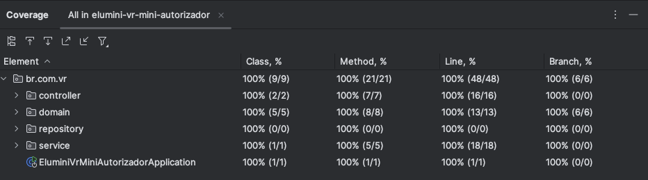

# Detalhes da Implementação

Este documento explica as práticas utilizadas, decisões de design e escolhas técnicas feitas durante o desenvolvimento do Mini Autorizador para o desafio da VR Benefícios.

## Objetivo do Projeto

Implementar um sistema RESTfull adotando a arquitetura REST capaz de realizar as seguintes operações:
1. Criar cartões com saldo inicial de R$ 500,00.
2. Consultar o saldo de um cartão específico.
3. Autorizar transações, aplicando regras de validação e garantindo a consistência em ambientes concorrentes.

---

## Estrutura do Projeto

### Tecnologias Utilizadas
- **Java 21**: Linguagem de programação principal.
- **Spring Boot**: Framework para construção de APIs REST.
- **Spring Data JPA**: Persistência de dados com H2 Database.
- **Lombok, final e final var**: Redução de código boilerplate.
- **JUnit** e **Mockito**: Testes unitários e mocks.
- **Docker Compose**: Configuração de ambiente com banco relacional (fornecido pela empresa)
- **H2 Database**: Banco de dados em memória para simplicidade de testes (utilizado para testes locais)

---

### Arquitetura

#### Organização de Pacotes
- **controller**: Contém os endpoints REST.
- **service**: Implementação da lógica de negócios.
- **repository**: Acesso ao banco de dados.
- **entity**: Representação das entidades persistidas no banco de dados.
- **exception**: Exceções personalizadas para diferentes cenários.
- **handler - exception**: Implementação do padrão Chain of Responsibility.
- **handler - controller**: Interceptar excecoes retornadas.

#### Padrões e Boas Práticas Adotadas

1. **RESTfull API**:
    - Cada endpoint foi implementado respeitando os contratos definidos no desafio.
    - Códigos de status HTTP refletem o estado correto de cada operação.

2. **Chain of Responsibility**:
    - Eliminei `if` e `else` no fluxo de validação utilizando o padrão *Chain of Responsibility*.
    - Regras de negócio como validação de senha e verificação de saldo foram encapsuladas em handlers específicos.
    - Os handlers são executados em cadeia, garantindo modularidade e clareza.

3. **Concorrência**:
    - Usei transações Spring (`@Transactional`) para garantir atomicidade.

4. **Clean Code**:
    - Código organizado e de fácil manutenção.
    - Nomes de classes, métodos e variáveis expressam sua funcionalidade de forma clara.

5. **Testes Automatizados**:
    - Foram escritos testes unitários para validar as principais funcionalidades e cenários de falha.
    - Simulação de transações concorrentes para verificar consistência.

6. **Scan de Vulnerabilidades e Falhas**:
   - Utilizados plugins como Sonar Lint e SNYK para localizar códigos duplicados, falhas, nomes de variáveis incorretos, etc. 
   - Unico ponto encontrado foram utilizacao de secrets no projeto podendo impactar na seguranca do projeto.

7. **Testes Unitários**:
    - Foi realiado 100% da cobertura dos testes unitários conforme evidencia.

---

## Decisões de Design

1. **Chain of Responsibility**:
    - Escolhido para eliminar o uso de condicionais e tornar as validações extensíveis.
    - Cada regra é encapsulada em um handler que pode ser reutilizado ou substituído.

2. **Exceções Personalizadas**:
    - Cada cenário de erro (ex.: `CARTAO_INEXISTENTE`, `SENHA_INVALIDA`) possui uma exceção personalizada.
    - Isso facilita o rastreamento e tratamento de erros.

3. **Banco de Dados em Memória**:
    - Utilização do H2 Database para simplificar a configuração e facilitar os testes.

4. **Modularidade**:
    - Regras e lógica de negócio separadas em camadas (controller, service, handler, etc.).
    - Novas regras de validação podem ser adicionadas facilmente sem modificar a lógica existente.

---

## Fluxo das Operações

### Criar Novo Cartão
1. Endpoint: `POST /cartoes`
2. O serviço verifica se o cartão já existe.
3. Caso não exista, um novo cartão é criado com saldo inicial de R$ 500,00.
4. Resposta com código 201 e os dados do cartão criado.

### Consultar Saldo
1. Endpoint: `GET /cartoes/{numeroCartao}`
2. O serviço busca o cartão no banco de dados.
3. Se encontrado, retorna o saldo com código 200.
4. Se não encontrado, retorna código 404 sem body.

### Realizar Transação
1. Endpoint: `POST /transacoes`
2. O serviço verifica as regras de autorização:
    - O cartão existe.
    - A senha é válida.
    - O saldo é suficiente.
3. Se todas as regras forem aprovadas, o saldo é debitado e a transação é confirmada.
4. Respostas possíveis:
    - 201: Transação aprovada.
    - 422: Transação rejeitada, com mensagem de erro (`CARTAO_INEXISTENTE`, `SENHA_INVALIDA`, `SALDO_INSUFICIENTE`).

---

## Desafios Resolvidos

1. **Sem `if` e `else`**:
    - Toda lógica de validação foi implementada utilizando o padrão *Chain of Responsibility*.
    - Isso torna o código mais modular e fácil de manter.

2. **Concorrência**:
    - Testado com simulações de múltiplas transações concorrentes.

---

## Possíveis Melhorias

1. **Melhorar Body**:
    - Utilizar body e retorno dos dados com mais dados e claros.

2. **Cache de Transações**:
    - Adicionar um sistema de cache para reduzir leituras frequentes no banco.

3. **Banco de Dados Não Relacional**:
    - Alternar para MongoDB em cenários onde o número de transações é muito alto.

4. **Quarkus**:
   - Realizar migracao do projeto para Quarkus ao invés do Spring Boot para melhor perfomance.

5. **Kubernetes**:
   - Por experiencia, aplicacoes como esta perfomam melhor com baixa de requests de cpu e alto limits de memoria e cpu.

6. **Banco de Dados Não Relacional**:
   - Alternar para MongoDB em cenários onde o número de transações é muito alto.

---

## Como Rodar o Projeto

1. Clone o repositório: `git clone https://github.com/jeferson0306/elumini-vr-mini-autorizador.git`.
2. Build da aplicação: `mvn clean install`.
3. Inicie a aplicação: `mvn spring-boot:run`.
4. Teste os endpoints utilizando swagger `http://localhost:8080/swagger-ui/index.html#/`.

---

## Autor

**[Jeferson Siqueira]**  
Desenvolvedor Backend (Java, Golang, Python, Node.JS)
